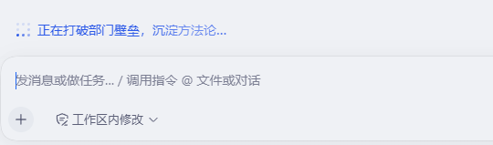
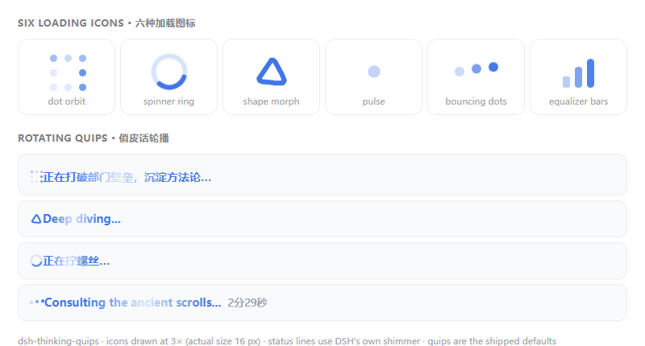

# dsh-thinking-quips

[English](README.md) · [中文](README.zh.md)

`v0.5.4` · a **DSH bundle** (install-and-go) · web client plugin

**Lightweight personalisation for the DeepSeek Harness status line.** It rotates
playful bilingual quips through the running-turn indicator — the line the
conversation shows while the agent is working (DSH's default `Deep diving...`
shimmer) — puts a chasing loading icon in front of it (six styles, three sizes),
and recolours both from a picker or from the active theme in one click.

Small on purpose: **no dependencies, no build step, no config file, no network
requests** — one hand-written client file, settings in `localStorage`, and stock DSH
packages are **not** modified.



## Features

1. **Six animated loading icons**, all in front of the running-turn text and all
   sized **S / M / L** (defaults: **dot orbit**, **M**):

   | Style | What it looks like |
   | --- | --- |
   | **Dot orbit** *(default)* | a 3×3 dot grid where the 8 outer dots chase clockwise — each lights up and fades with a trailing tail — while the center stays empty |
   | **Spinner ring** | a real SVG circle: a faint full track with a bright round-capped arc sweeping around it |
   | **Shape morph** | one outline that becomes a circle → a rounded triangle → a rounded square → a circle again — all three sharing one centre, so it changes in place — while turning with an eased lag that settles into each shape |
   | **Pulse** | a single dot breathing in and out |
   | **Bouncing dots** | three dots bouncing in sequence |
   | **Equalizer bars** | three bars scaling from the baseline |

   Every style inherits the chosen **font color** (brand blue by default).
2. **Rotating quips**, organized by language in the settings textarea, with one
   **Language** control deciding which section shows: **Follow UI** (Chinese UI →
   Chinese quips; any non-Chinese UI → English), **English only**,
   **Chinese only**, or **Mixed** (both sections).
3. **Time per quip** — a number input (default **8 s**) for how long each quip
   stays before rotating.
4. **Glow strength** — a number input (0–100%, default **35%**) for how bright the
   sweeping highlight is.
5. **Font color** — a live preview swatch plus **hex** and **RGB** inputs and a
   **native color wheel** (`<input type="color">`). The default is the DeepSeek
   brand-blue shimmer.
6. **Match theme** — one button reads the accent color of the **active theme** off
   the live DOM (`--dsw-alias-link`, i.e. DSH's own light/dark accent, so a
   third-party theme's tokens come along for free), keeps the hue and fits the
   lightness until the color reaches **≥ 4.5:1 contrast** against the current
   background. Once matched the color **keeps following** theme switches
   (light ↔ dark, or a theme change) until you press **Stop following** or edit the
   color by hand; the row reports what it read and what it produced
   (`#4176e6 → #3970e5 · contrast 4.5:1 · light`), and a **Back to brand blue**
   button appears whenever a custom color is in effect.
7. **Manage quips** — a small modal with one editable textarea using `#` language
   sections, and a Save button in the footer:

   ```
   # Chinese
   a Chinese quip
   another Chinese quip
   # English
   an English quip
   another English quip
   ```

   One quip per line (`;` also works inside a section). Lines before the first
   `#` header always show, in every mode.
8. **Indicator-only mode** — inject only the icon and leave the status text alone,
   so the plugin can coexist with another status-text plugin instead of replacing it.



All of it lives in **Settings → General → Playful quips**.

> **Requires DSH >= 0.1.2-rc.1** (the web surface). Config lives in `localStorage` —
> no config file, no network requests, no file writes. `prefers-reduced-motion` is
> respected, and the status element is matched by its stable class token first.

> The textarea is the **single source of quips**: it ships pre-filled with the
> default `# Chinese` / `# English` lists, so there is no separate hard-coded
> fallback. Edits persist; **Reset to default** restores the shipped lists.

The settings UI itself is bilingual and **follows the web UI's language** — this
page shows the English labels; the [中文 README](README.zh.md) shows the Chinese
ones you get with a Chinese UI.

## How it works

While a turn runs, `dsh-client-ui-conversation` renders a `TurnStatus` element
(`role="status"`, class `...turnStatus`) at the bottom of the chat. That element
is **hardcoded — not a pluggable slot** — so this plugin hooks it from outside: a
`MutationObserver` catches it the moment it is committed (so `Deep diving...`
never flashes), a light poll keeps the text rotating, and only the leading text
node is swapped, leaving the trailing elapsed-clock span untouched.

Config is persisted to `localStorage` (`dsh-thinking-quips.config`) and mirrored
in a small reactive store, so the rotator, the color override and the settings row
stay in sync. When a custom color is chosen, the plugin injects a `<style>`
override that replaces only the `background-image` of the shimmer gradient — DSH's
own animated shine and text clip stay intact.

**Match theme** reads the theme instead of guessing at it. DSH's layout presenter
writes every theme token onto `<body>` as an inline custom property (and toggles
`body[data-ds-dark-theme]`), so the button resolves `--dsw-alias-link` —
falling back through `--dsw-alias-state-business-primary` and the
`--dsw-static-deepseek-*` ramp — from computed styles *of the button itself*,
which inherits them. The background comes from `--dsw-alias-bg-base`. A second
`MutationObserver` watches those body attributes, so while the follow flag is on
a theme switch re-fits the color automatically. Everything is read from the DOM:
no DSH package is imported and no theme service is required.

## Files

```
dsh-thinking-quips/
├── package.json         # dsh.bundle (patch) + dsh.client + exports["./client"]
├── cordis.patch.yml     # bundle patch: registers this package as a client roster row
├── lib/
│   ├── client.js        # browser half: rotator + loaders + settings row + modal
│   └── index.js         # node half: no-op apply (so the loader can mount the row)
├── assets/screenshot-1.png
├── screenshots.json     # screenshot list read by storefronts (repo-only)
└── test/                # dev-only smoke tests (excluded from the package)
    ├── test-load.mjs      # factory/apply/color override/rotation/cleanup
    ├── test-sections.mjs  # quip sections + language selection
    ├── test-loaders.mjs   # the six loading indicators (DOM + CSS)
    ├── test-morph.mjs     # the shape-morph geometry and motion quality
    ├── test-theme.mjs     # theme extraction + contrast fitting
    ├── test-settings-ui.mjs # which buttons the settings row shows in which state
    └── test-i18n.mjs      # zh/en dictionary parity
```

## Install (bundle — install and it just works)

`dsh-thinking-quips` is a DSH **bundle**: its own `cordis.patch.yml` registers the
client-roster row, so the only manual step is listing it in the profile's
`dsh.profile.bundles`.

1. Install the package into the target profile's deps — from GitHub (this repo) or
   a registry:
   ```sh
   # from GitHub (git dependency)
   dsh plugin --profile web add github:Saknutella/dsh-thinking-quips

   # or from a registry
   dsh plugin --profile web add dsh-thinking-quips
   ```
2. Add it to `$DSH_HOME/profiles/web/package.json` → `dsh.profile.bundles`:
   ```json
   "dsh": { "profile": { "bundles": ["@deepseek-ai/dsh-base", "@deepseek-ai/dsh-web-app", "dsh-thinking-quips"] } }
   ```
3. Restart:
   ```sh
   dsh web
   ```

> That's it: the bundle's patch inserts `{id: thinking-quips, name: 'dsh-thinking-quips'}`
> into the browser roster, and because the package declares `dsh.client`, the Web UI
> serves `/plugins/dsh-thinking-quips/client.js` and the browser loads it. No
> hand-editing of `cordis.patch.yml`.

## Uninstall

Remove `dsh-thinking-quips` from `dsh.profile.bundles`, then
`dsh plugin --profile web remove dsh-thinking-quips`, and restart `dsh web`.

## Usage

Open **Settings → General** and find **Playful quips**:

- **Font color** — click the swatch or the color wheel; type a `#RRGGBB` hex or
  RGB values. The turn-status shimmer recolors in real time.
- **Match theme** — the button next to the inputs reads the active theme's accent,
  fits it to the current background and applies it; the line underneath reports
  `#read → #applied · contrast N:1 · light|dark`. While it is active the button
  reads **Following theme** and the color tracks every theme switch.
- **Stop following** — appears next to it only while following: it keeps the color
  that is on screen and drops the follow flag. Editing the wheel, hex or RGB inputs
  does the same thing, so following never traps you.
- **Back to brand blue** — appears only once a custom color is set, and restores
  DSH's own untouched shimmer (the plugin's color override is removed entirely).
- **Time per quip** — seconds per quip (default 8).
- **Glow strength** — 0–100% (default 35). At brand blue with glow 35 the original
  shimmer is left untouched; changing the glow (or picking a custom color) applies
  a controllable highlight in that color.
- **Language** — one group of four: **Follow UI**, **English only**,
  **Chinese only**, **Mixed**. This decides which section of the quips list shows.
- **Loader icon** — two dropdowns side by side: the **style** (Dot orbit, Spinner
  ring, Shape morph, Pulse, Bouncing dots, Equalizer bars) and the **size** (Small,
  Medium, Large). Changes apply to the live status line within a second.
- **Indicator only** — inject only the loading icon and leave the status text
  alone, so the plugin can sit alongside another status-text plugin instead of
  replacing it.
- **Manage quips** — opens the modal; **Save** writes the textarea back.
- **Reset to default** — restores the shipped defaults.

## Tune

Defaults live in `lib/client.js`:

- `DEFAULT_QUIPS` — the shipped quip lists (already sectioned `# Chinese` /
  `# English`).
- `LOADER_STYLES` — the loader dropdown order (`orbit`, `ring`, `pulse`, `dots`,
  `bars`, `morph`); `LOADER_SCALES` — the `sm`/`md`/`lg` multipliers (`0.8` / `1` / `1.25`).
- `MORPH_*` — the shape morph: `MORPH_ORDER` (circle → triangle → square),
  `MORPH_CHAMFER` (how much of each corner is cut, i.e. how rounded the shapes are),
  `MORPH_RADIUS`, `MORPH_SAMPLES` and `MORPH_CYCLE_MS` (3.3 s, one second per shape).
- `DEFAULT_BLUE` (default `#2E5BE8`) — the color wheel's starting color.
- `THEME_COLOR_TOKENS` — the accent candidates Match theme tries in order
  (`--dsw-alias-link`, `--dsw-alias-state-business-primary`,
  `--dsw-static-deepseek-500`, `--dsw-static-deepseek-450`); `THEME_BG_TOKENS` —
  the background candidates; `MIN_CONTRAST` (default `4.5`) — the contrast the
  fitted color must reach.
- `POLL_MS` (default `600`) — how often the status text is re-asserted.
- `quipMs` / `glow` / `loader` / `loaderSize` / `colorTheme` — per-quip timing,
  highlight strength, the icon default and the theme-follow flag (per-user, in
  `DEFAULTS`).

## Notes / limits

- The plugin is **additive**: one package plus one line in `dsh.profile.bundles`,
  and no DSH file is touched. Uninstalling restores stock DSH.
- The status element is matched by the stable `turnStatus` class token first, then
  by the default label — `Deep diving...` / `深度求索中...`, which DSH renders from its
  `chat.deepDiving` key. If a future DSH build renames both, the plugin silently
  stops matching — it never throws and never breaks the shell.
- The color override only replaces the shimmer's gradient colors; the animated
  shine and the text clip come from DSH's own `.turnStatus` rule.
- **Match theme** reads *computed* custom properties, so it follows whatever the
  active theme (built-in or third-party) actually paints, and it never imports a
  DSH package. If none of the candidate tokens resolve — an unusual build, or a
  theme that rewrites the whole token set — it falls back to fitting the brand
  blue and says so instead of failing.
- Config (quips, color, glow, timing) persists in `localStorage` per browser
  profile, not in the DSH settings document.
- **Requires DSH >= 0.1.2-rc.1** (the web surface — a profile bundling
  `@deepseek-ai/dsh-web-app`) and React 18, which DSH ships. Verified on
  `0.1.5-rc.2`, where the running-status line lives in `dsh-client-ui-chat`.
