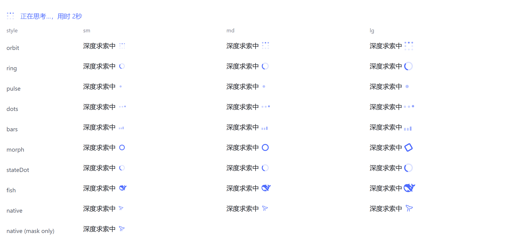

# dsh-thinking-quips

[English](README.md) · [中文](README.zh.md)

`v0.11.3` · a **DSH bundle** (install-and-go) · web client plugin

**Lightweight personalisation for the DeepSeek Harness status line** — the line the
conversation shows while the agent is working (DSH's default `Deep diving...`).
Rotating bilingual quips, sixteen loading icons in three sizes, one-click colour presets,
theme-colour matching that reaches 4.5:1, and an optional elapsed-time readout, all in
**Settings → Playful quips** (its own page in the settings nav, not a row under General).

Incremental by design: no dependencies, no build step, no config file, no network
requests. One hand-written client file, settings in `localStorage`, and stock DSH
packages are **not** modified.



## Features

- **Sixteen loading icons** — dot orbit (default), shape morph, pulse, bouncing dots,
  equalizer bars, **eight drawn sprites** from two contributed design families
  (a jelly block that squashes, a metronome arm, a mallet with sparks, a pinwheel, two rings
  rippling outwards, a bead running its track, a pair of sparkle stars and a bouncing ball with
  its own shadow), plus three that reuse what DSH already ships: the official `StateDot` spinner (the plugin's own ring went in 0.11.2 —
  the two were the same gesture), its logo mark, and **DSH's own running whale** (cloned out of the live line, animation included) — each
  in **S / M / L**.
  DSH's whale is one of the choices rather than a permanent neighbour, so the line always
  shows exactly one indicator; pick **Official whale** to have it back.
- **Rotating quips** — your own list, one per line, split into `# Chinese` /
  `# English` sections and edited in a small modal; the **Language** control picks
  which section shows (Follow UI, English only, Chinese only, or Mixed).
- **Font colour** — preview swatch, hex, RGB, or the native colour wheel.
- **Colour presets** — brand blue, violet, teal, amber and **rainbow**, one click each. Every chip
  is fitted to the background that is on screen and floored at 4.5:1, so the same chip stays legible
  in the light *and* the dark theme, and picking one stops **Match theme** from following (you named
  a colour). Brand blue writes the plugin's default sentinel, so "brand blue" still means DSH's own
  default rather than an override of it. **Rainbow** cycles the line's colour — icon included —
  through six colours that are each fitted and floored, so the promise holds at every moment of the
  cycle, while the chip itself stays a still spectrum; the cycle follows Slow / Normal / Fast and
  freezes at the first colour when the system asks for reduced motion.
- **Sweep brightness** — 0–100%, how much brighter the official sweep's moving highlight is
  than the text (0% makes it the text colour, i.e. an invisible sweep; 100% is white). It
  writes the token the official `TextShimmer` paints that highlight with.
- **Match theme** — one click fits the active theme's accent colour to at least 4.5:1 against
  the live background, and keeps following theme switches until you stop it.
- **Text effect** — **Shimmer** (default: DSH's own sweep, because the plugin renders the
  official `TextShimmer` component) or **Wave** (each character/word lifts in turn). Two
  choices, not four: the hand-painted "glow" copy of the official sweep was
  indistinguishable from it side by side, so it was retired.
- **Elapsed time** — **Inline** folds the duration into the quip so it animates with
  the text (the DSH 0.2 shape), **Beside** shows it as a separate grey note outside the
  animation (the 0.1 shape), or turn it **off**. The time comes from DSH's own turn
  start (`turn.start.time`) and formats exactly like the official `formatRunDuration`.
- **Animation speed** — **Slow / Normal / Fast** in one click. Normal is the shipped
  pace and overrides nothing; the others scale the plugin's own animations. DSH's own
  whale carries its animation inside the image (a 60-frame APNG), so for that one the
  plugin adds its own swim cue at the chosen pace instead.
- **Time per quip**.
- **Indicator only** — inject just the icon and leave the status text alone, so it
  can sit alongside another status-text plugin.

## Install

1. Add the package to the profile:
   ```sh
   dsh plugin --profile web add github:Saknutella/dsh-thinking-quips
   ```
2. Add it to `dsh.profile.bundles` in `$DSH_HOME/profiles/web/package.json`:
   ```json
   "dsh": { "profile": { "bundles": ["@deepseek-ai/dsh-base", "@deepseek-ai/dsh-web-app", "dsh-thinking-quips"] } }
   ```
3. Restart `dsh web`.

**Requirements:** DSH ≥ 0.2.0-rc.2 (the web surface). On 0.2 the running line is
`[data-chat-running]` and its label lives inside DSH's `TextShimmer`; the plugin detects
both that shape and the older `[class*="turnStatus"]` one, so 0.1.x shells keep working.

**Uninstall:** remove it from `dsh.profile.bundles`, run
`dsh plugin --profile web remove dsh-thinking-quips`, and restart `dsh web`.
